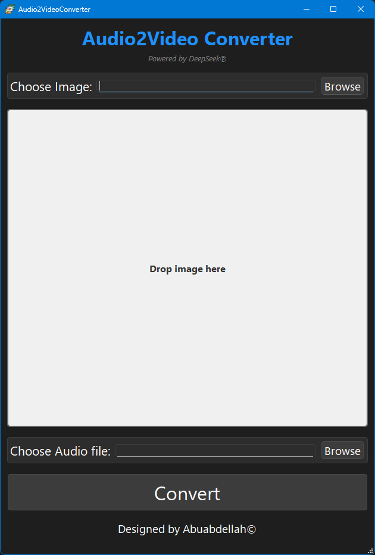
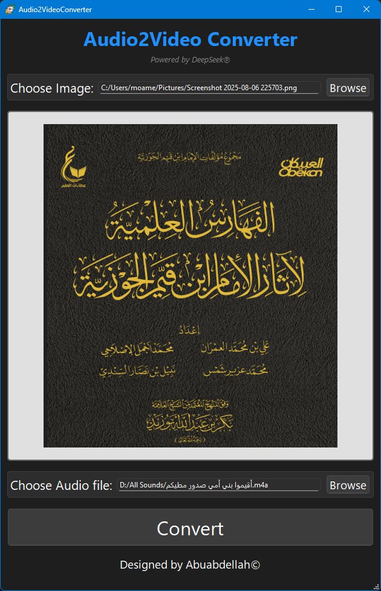
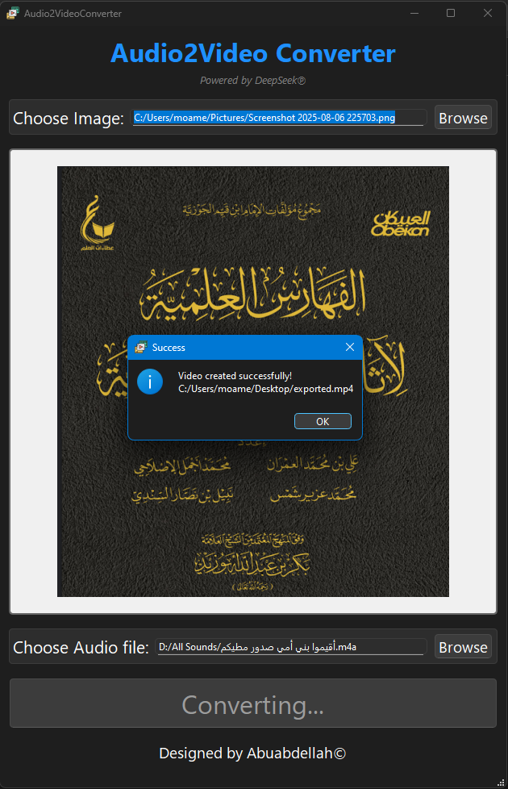
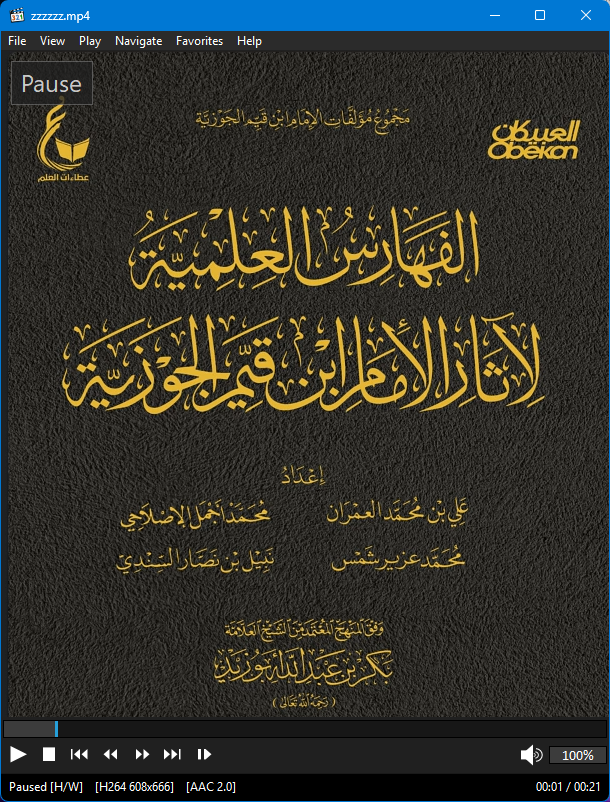

<p align="center">
  
</p>

# 🎬Audio2Video Converter

<div align="center">


**A powerful desktop application for converting audio files into static video clips using a single image, allowing you to upload audio to platforms that only accept video files, such as Facebook and X (Twitter).**

[Features](#-features) • [Installation](#-installation) • [Usage](#-usage) • [Screenshots](#-screenshots) • [Contributing](#-contributing)

</div>

---

## 🌟 Features

### 🎵 **Audio Processing**
- ✅ Import any audio file (MP3, WAV, OGG, M4A, FLAC)
- ✅ Trim a specific section of the audio track (start and end time)
- ✅ Cut or merge multiple audio files into a single video
- ✅ Automatic volume and bitrate adjustment
- ✅ Batch processing of multiple audio files at once

### 🖼️ **Background Image System**
- 🖼️ Support for background images in PNG, JPG, and JPEG formats
- 📱 Option to choose a different image for each audio file during batch processing
- 🔄 Automatic scaling and centering of the image to fit the video dimensions
- 📐 Automatic image dimension detection or manual adjustment
- 🎯 Precise positioning of the image within the video frame

### 🎬 **Advanced Video Options**
- 📝 Output video in multiple formats (MP4, MOV)
- 🌍 Customizable video resolution (1080p, 720p, square for stories, vertical for reels)
- 🎨 Adjustable frame rate (FPS) and bitrate
- 📍 Add a fixed title bar or text overlay on the video (optional)
- ✨ High-quality encoding that preserves the original audio fidelity

### ⚙️ **Smart Output Options**
- 🔄 **Ready-made presets**:
  - `facebook` - Dimensions and resolution suited for Facebook posts
  - `x_twitter` - Dimensions and resolution suited for X (Twitter) posts
  - `instagram_story` - Vertical dimensions suited for Stories and Reels
  - `custom` - Manually set dimensions and settings
- 📏 Smart detection of the best resolution based on the selected image
- 🔍 Output quality control (low, medium, high, original)

### 🖥️ **Modern User Interface**
- 🌙 Dark theme with a professional look
- 👀 **Live preview** of the first frame of the resulting video
- 🖱️ Easy drag-and-drop workflow
- 💾 Save/load project settings
- ⚡ Multi-threaded processing with progress tracking

---

## 📸 Screenshots

<!-- Add screenshots here -->
<!-- Suggested screenshot locations: -->

### Main Interface


*The main application window showing all controls and the live preview*

### Background Preview


*Instant preview of how the image will look as the video background*

### Output Settings

</br>
*Video Output Success Notification*

### Processing Results


*Final Result of audio files converted into video*

---

## 🚀 Installation

### Prerequisites
- Python 3.7 or higher
- Windows, macOS, or Linux
- FFmpeg installed on the system

### Mandatory:
- FFmpeg build is required to be able to run the repo in your development environment.</br>
- Download the ffmpeg-git-full.7z <a href="https://www.gyan.dev/ffmpeg/builds/" title="ffmpeg build">Here</a> then create a new folder 
 ``` ffmpeg/bin ``` and place ``` ffmpeg.exe ``` inside.
### Method 1: Using pip (Recommended)
```bash
# Clone the repository
git clone https://github.com/yourusername/audio2video-converter.git
cd audio2video-converter

# Install dependencies
pip install -r requirements.txt

# Run the application
python audio2video_customtk.py
```

### Method 2: Manual Installation
```bash
# Install required packages individually
pip install customtkinter
pip install moviepy
pip install Pillow
pip install pydub  # for audio processing and merging
```

### Dependencies
```
customtkinter>=5.0.0
moviepy>=1.0.3
Pillow>=9.0.0
pydub>=0.25.0
```

---

## 🎯 Usage

### Quick Start
1. **📁 Load Audio**: Click "Browse" next to "Audio File" and select your audio file
2. **🖼️ Choose Image**: Select the image that will appear as the static video background
3. **▶️ Process**: Click "RUN" to generate the final video file

## 🛠️ Technical Details

### Supported Formats
- **Audio Input**: MP3, WAV, OGG, M4A, FLAC
- **Images**: PNG, JPG, JPEG
- **Output**: High-quality MP4 with embedded audio

### Performance
- **Multi-threading**: Non-blocking UI during processing
- **Memory Efficiency**: Handles long audio files without memory issues
- **High Quality**: Configurable video encoding that preserves the original audio quality

### Audio Support
- **Full Processing**: Comprehensive support for most common audio formats via Pydub
- **Auto-Detection**: Automatically determines the audio file's duration and bitrate
- **Embedded Encoding**: Ensures consistent compatibility across social media platforms

---

## 🤝 Contributing

We welcome contributions! Here's how you can help:

1. **🍴 Fork** the repository
2. **🌿 Create** a feature branch (`git checkout -b feature/AmazingFeature`)
3. **💾 Commit** your changes (`git commit -m 'Add some AmazingFeature'`)
4. **🚀 Push** to the branch (`git push origin feature/AmazingFeature`)
5. **📬 Open** a pull request

### 🐛 Bug Reports
Please use the [issue tracker](https://github.com/yourusername/audio2video-converter/issues) to report bugs or request features.

---

## 📋 Roadmap

- [ ] **Background Editor**: Built-in background image creation and editing tools
- [ ] **Batch Processing**: Convert multiple audio files into video at once
- [ ] **Cloud Background Library**: Online repository of images and backgrounds
- [ ] **Waveform Effects**: Display an animated audio waveform over the background
- [ ] **Mobile App**: Companion app for iOS/Android

---

## 📜 License

This project is licensed under the MIT License - see the [LICENSE](LICENSE) file for details.

---

## 🙏 Acknowledgments & Attribution

- The **MoviePy** team for excellent audio and video processing capabilities
- **CustomTkinter** for the modern GUI framework
- **Pydub** for advanced audio processing support
- **Pillow** for image processing functionality
- **FFmpeg** for the reliable encoding engine 
This application uses FFmpeg. FFmpeg is licensed under the LGPL/GPL.
The source code for the FFmpeg build used in this release can be found at: <a href="https://www.gyan.dev/ffmpeg/builds/" title="ffmpeg build">FFmpeg Build - Gyan.dev</a>
- <a href="https://www.flaticon.com/free-icons/video" title="video icons">Video icons created by Eucalyp - Flaticon</a>

---

<div align="center">

**⭐ Star this repository if you found it useful! ⭐**

[Report a Bug](https://github.com/yourusername/audio2video-converter/issues) • [Request a Feature](https://github.com/yourusername/audio2video-converter/issues) • [Discussions](https://github.com/yourusername/audio2video-converter/discussions)

Made for everyone who has audio that needs a video, by [Abu Abdullah](https://github.com/Abuabdellah-Al)

</div>
